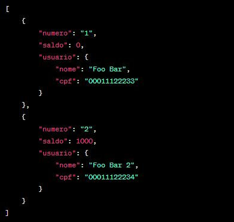

# API do Banco Digital - Desafio Módulo 2

Este é um projeto de construção de uma API RESTful para um Banco Digital como parte do Desafio Módulo 2 da CUBOS. A API oferece funcionalidades para gerenciar contas bancárias, realizar operações financeiras como depósitos, saques e transferências, além de consultar saldos e emitir extratos.

## Funcionalidades

- Criar uma conta bancária.
- Listar contas bancárias existentes.
- Atualizar os dados do usuário da conta bancária.
- Excluir uma conta bancária.
- Realizar depósitos em contas bancárias.
- Realizar saques de contas bancárias.
- Transferir valores entre contas bancárias.
- Consultar o saldo de uma conta bancária.
- Emitir o extrato bancário de uma conta.

## Como Executar

1. Clone o repositório.
2. Instale as dependências com `npm install`.
3. Inicie o servidor com `npm start`.
4. Acesse os endpoints utilizando um cliente HTTP (como o Postman).

## Exemplo de Uso

### Listar Contas Bancárias

**GET /contas?senha_banco=Cubos123Bank**

## Considerações Finais

Este projeto é uma API funcional para um Banco Digital, aplicando os princípios REST e garantindo a validação adequada das operações financeiras. 🚀
